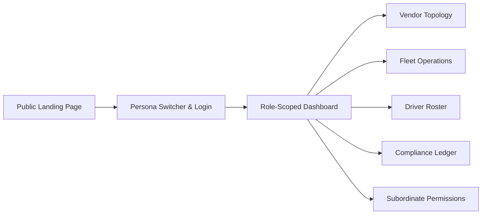

# CabNexus — Vendor, Fleet & Driver Management Platform

[](https://www.typescriptlang.org/)
[](https://react.dev/)
[](https://vitejs.dev/)
[](https://tailwindcss.com/)
[](https://vitest.dev/)

> An enterprise fleet governance and hierarchical operations system designed for multi-tier cab networks, cross-regional delegation, and automated regulatory compliance.

---

## 1. Project Overview

Large commercial taxi networks struggle with operational bottlenecks, fragmented compliance audits, and uncontrolled privilege escalation across multi-level vendor hierarchies. Regional partners and municipal fleet operators require operational autonomy to onboard drivers and dispatch cabs, yet headquarters must enforce national compliance policies, dispatch holds, and strict delegation boundaries.

**CabNexus** solves this by providing:
- **Hierarchical Governance**: Structured parent-child relationship modeling ($L1 \to L2 \to L3 \to L4 \to L5$).
- **Cascading RBAC & Permission Delegation**: Supervisors delegate or restrict granular operational permissions strictly down their organizational subtree. Subordinates cannot manage or grant privileges withheld by higher tiers.
- **Strict Role Prohibitions**: Business rules built directly into the UI (e.g., commercial drivers cannot self-audit or approve compliance documents).
- **Audit-Ready Operations**: Real-time vehicle registries, 1:1 driver bindings, interactive compliance verification, and tamper-proof audit streams.

---

## 2. Key Features & Implementation Matrix

| Capability | Business Problem Solved | Frontend Implementation |
| :--- | :--- | :--- |
| **N-Level Vendor Hierarchy** | Solves disconnected national vs. regional operational views. | Recursive tree traversal (`getSubtreeVendorIds`, `getControlledVendors`), reactive topology tree view, and breadcrumb tracking. |
| **Cascading Delegation Engine** | Prevents unauthorized privilege escalation across tiers. | Dynamic permission inheritance checks (`isUserPermissionGrantedByParent`), auto-hiding policies not possessed by supervisors. |
| **Vehicle Onboarding & Hold** | Prevents non-compliant vehicles from taking dispatches. | Multi-field validation modal (RC, permit, fuel type, seating), quick-toggle dispatch hold state, and status filtering. |
| **Commercial Driver Roster** | Eliminates unlicensed driver allocations and unlinked cabs. | Driver registry with 1:1 vehicle bindings, badge verification, and contact cards. |
| **Document Compliance Ledger** | Reduces manual regulatory auditing friction. | Expiry countdowns, mock browser file uploads, and conditional sign-off authorization barred for drivers. |
| **Operational Stream & Audit** | Provides transparency for sensitive delegation actions. | Tamper-proof activity ledger logging actor, target entity, timestamp, and permission delta. |

---

## 3. Tech Stack

- **Core & Framework**: React 19, TypeScript (strict type safety)
- **Build & Tooling**: Vite 8, Vitest, Testing Library (React & DOM), JSDOM
- **Styling & UI Components**: Tailwind CSS, PostCSS, Lucide React icons
- **Form Management & Validation**: React Hook Form, Zod, `@hookform/resolvers`
- **Routing & State**: React Router 7 (`react-router-dom`), React Context API + Custom Hook architecture
- **Data Visualization**: Recharts (compliance health and vehicle status charts)

---

## 4. Application Flow



1. **Landing Page (`/`)**: Feature showcases, interactive role delegation simulator, and fleet health metrics.
2. **Login Persona Switcher (`/login`)**: Realistic credential selection with email, organization level badges ($L1$–$L5$), and supervisory reporting lines.
3. **Dashboard Overview (`/dashboard`)**: Role-scoped KPI cards, live operational audit feed, and vehicle status breakdowns.
4. **Vendors Page (`/dashboard/vendors`)**: Dual-view toggle between an expandable Tree Map and searchable operational Table.
5. **Fleet Page (`/dashboard/fleet`)**: Vehicle roster with registration search, fuel filter, and instant dispatch hold toggling.
6. **Drivers Page (`/dashboard/drivers`)**: Driver database with 1:1 cab bindings and badge verification.
7. **Compliance Page (`/dashboard/compliance`)**: Document expiration monitors with local file picker and audit sign-off workflows.
8. **Permissions Page (`/dashboard/permissions`)**: Subordinate and driver privilege configuration with parent-authority filtering.

---

## 5. Roles & Access Hierarchy

CabNexus enforces 5 distinct operational privilege tiers:

- **Level 1 — Super Vendor (`Arjun Mehta`)**: National scope. Unrestricted oversight, root security overrides, and global configuration.
- **Level 2 — Regional Hub Leaders (`Harpreet Singh` - North Hub, `Priya Nair` - South Hub)**: Regional jurisdiction. Oversees state fleets, regional compliance, and state operations.
- **Level 3 — City / State Fleet Leads (`Gurjeet Kaur` - Punjab, `Deepak Rao` - Karnataka, etc.)**: City-level allocation, dispatch management, and municipal fleet onboarding.
- **Level 4 — Local Fleet Operators (`Manpreet Gill` - Amritsar)**: Local municipal fleet monitoring and assigned driver oversight.
- **Level 5 — Commercial Drivers (`Raj Kumar`, `Karthik Raman`, etc.)**: Cab operators. Read-only fleet access; strictly prohibited from approving compliance documents.

---

## 6. Architecture & State Management

```
src/
├── __tests__/           # Vitest integration & component suites (14 tests)
├── components/          # Reusable UI primitives and layout shells
│   ├── dashboard/       # Dashboard shell, header, sidebar, role badges
│   └── landing/         # Marketing blocks, interactive permission simulator
├── context/             # Global RoleContext and RBAC route guards
├── data/                # Mock data stores, user profiles, and vendor topology
│   ├── dashboardData.ts # Vendors, initial mock stats, UserProfile schema
│   └── usersData.ts     # Multi-regional personnel store & reporting lines
├── hooks/               # Custom state management hooks
│   └── useHierarchyUsers.ts # Tree traversal, controlled vendor queries, parent inheritance
├── pages/               # Routed page views
│   ├── dashboard/       # Overview, Vendors, Fleet, Drivers, Compliance, Permissions
│   ├── LandingPage.tsx  # Product showcase & marketing view
│   └── LoginPage.tsx    # Role authentication & user switcher
└── types/               # TypeScript schemas and data interfaces
```

### Architecture Highlights:
- **In-Memory & Persistent State**: Uses initial seed files (`usersData.ts`, `dashboardData.ts`) combined with `localStorage` persistence for stateful runtime changes (new vehicles, toggled permissions, document uploads).
- **Subtree Tree Traversal**: The `useHierarchyUsers` hook recursively resolves downward reporting lines using depth-first tree traversal.
- **Parent Governance Rule**: Permission delegation UI dynamically computes valid actions against the supervisor's active privileges:
  $$\text{Visible Permissions} = \{ p \in \text{Policies} \mid \text{SupervisorHas}(p) \lor \text{Level} = 1 \}$$
- **Zero Mock Overengineering**: No artificial backend delays or broken endpoints; responsive synchronous state transitions tailored for clean evaluation.

---

## 7. Screenshots & Interface Previews

### Role Switcher & Login

*Persona switcher showing email addresses, privilege badges, and supervisory reporting lines.*

### Vendor Topology & Tree Map

*Multi-level vendor tree view reflecting parent-child dependencies and vehicle capacity allocations.*

### Subordinate & Driver Permission Governance

*Granular permission control scoped strictly to authorized subordinates with parent authority inheritance.*

---

## 8. Getting Started

### Prerequisites
- **Node.js**: v18.0.0 or higher (or Docker)
- **npm** (or `pnpm` / `yarn`)

### Option A: Local Development

```bash
# 1. Clone the repository
git clone https://github.com/prammbhs/CabNexus.git
cd CabNexus

# 2. Install dependencies
npm install

# 3. Start local development server
npm run dev

# 4. Run test suite
npm test

# 5. Type-check TypeScript & production build
npm run build
```

The application will be accessible at `http://localhost:5173`.

---

### Option B: Run with Docker (Production Nginx Container)

CabNexus includes a multi-stage `Dockerfile` and custom `nginx.conf` with SPA routing and asset caching.

```bash
# 1. Build the Docker container image
docker build -t cabnexus:latest .

# 2. Run container on port 80 (mapped to localhost:8080 or port 80)
docker run -d -p 8080:80 --name cabnexus-app cabnexus:latest

# 3. View running container
docker ps
```

Open your browser at `http://localhost:8080`.

To stop the container:
```bash
docker stop cabnexus-app && docker rm cabnexus-app
```

---

## 9. Performance & Scalability Considerations

- **Memoized Hierarchy Lookups**: Tree traversals (`getControlledVendors`, `getSubtreeVendorIds`) are memoized via `useCallback` to prevent redundant tree recomputations on render.
- **Set-Based $O(1)$ Membership Checks**: Controlled IDs and descendant sets are converted to native `Set<string>` structures for efficient authorization checks.
- **Zero Heavy UI Dependencies**: Built with utility-first Tailwind CSS without bulky component framework bundles, maintaining minimal bundle size and near-instant initial paint.
- **Optimized Re-renders**: Local component state handles accordion toggles and search inputs while propagating updates to the global user hierarchy store only on confirmed actions.

---

## 10. Future Roadmap

- [ ] **Backend Integration**: Replace in-memory stores with REST/GraphQL endpoints and PostgreSQL/Prisma persistence.
- [ ] **Enterprise Identity Provider**: Integrate OAuth2 / SAML / OIDC (Auth0 or Supabase Auth) for real role claims.
- [ ] **S3 Document Vault**: Secure presigned URL uploads for actual RC and commercial taxi permit PDFs.
- [ ] **Automated Telematics**: Real-time GPS ingest and automated dispatch holds triggered by geofence breaches.

---

## 11. Repository & Links

- **GitHub Repository**: [https://github.com/prammbhs/CabNexus.git](https://github.com/prammbhs/CabNexus.git)
